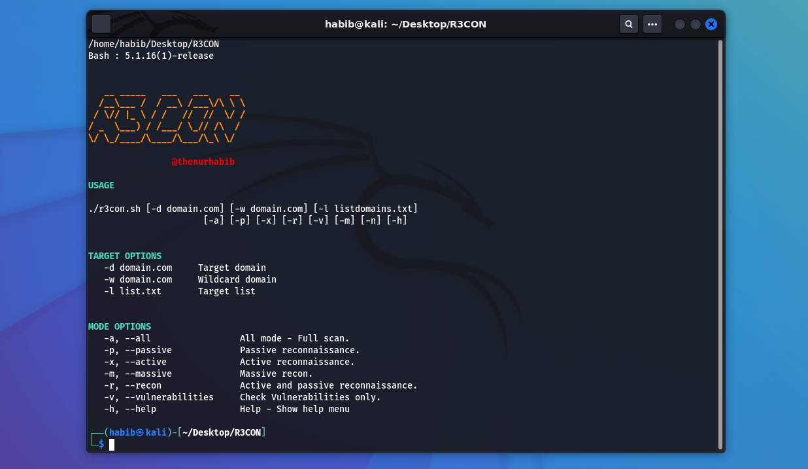
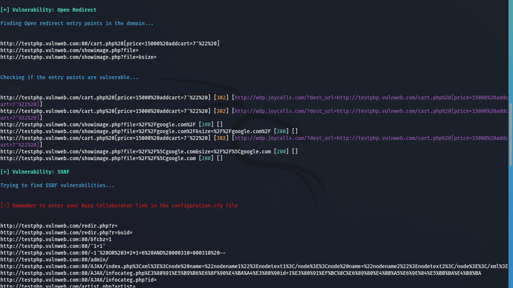
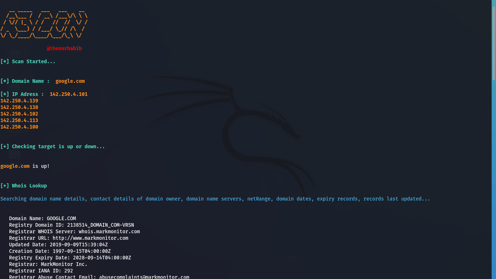
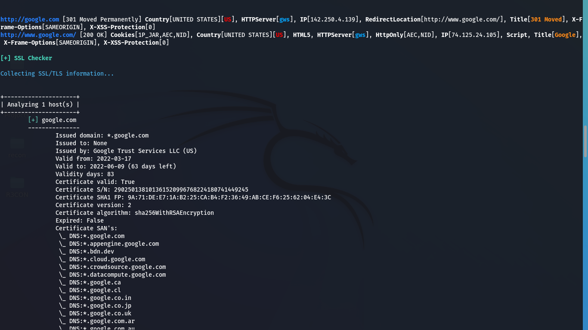
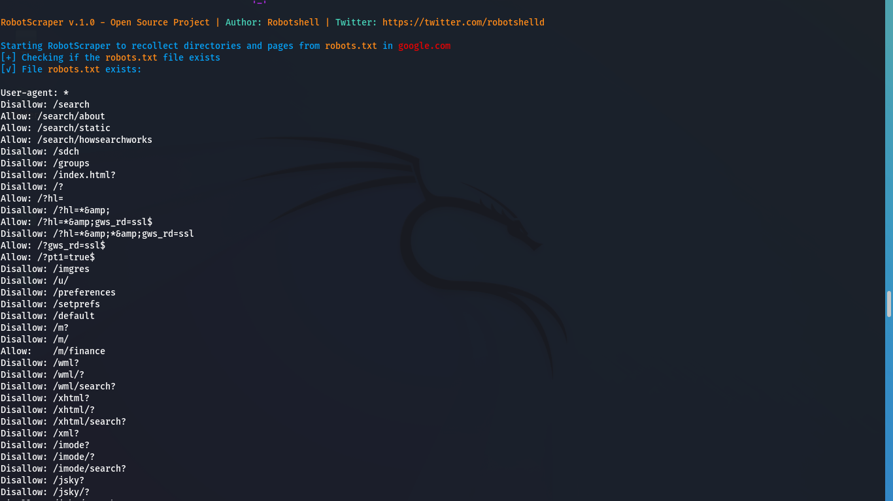
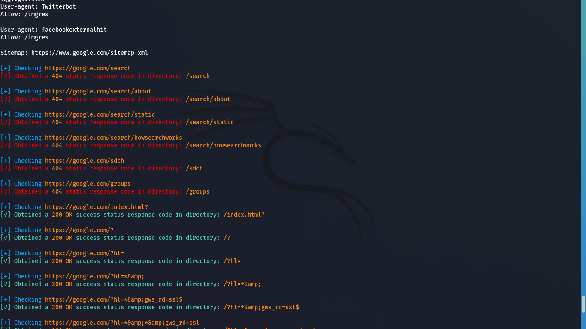

<h1 align="center">
  <br>
  <a href="https://github.com/thenurhabib/r3con"></a>
  <br>
  R3CON
  <br>
</h1>

<h4 align="center">Multifunctional Web Recon & Vulnerability Scanner Tool</h4>

<p align="center">
  <a href="https://github.com/thenurhabib/r3con/releases">
    
  </a>
  <a href="https://travis-ci.com/thenurhabib/r3con">
    
  </a>
  <a href="https://github.com/thenurhabib/r3con/issues?q=is%3Aissue+is%3Aclosed">
      
  </a>
</p>




##### r3con is a Multifunctional Web Recon & Vulnerability Scanner Tool and incredibly fast crawler that can find multiple vulnerabilitys and gather information.


### Check for vulnerabilities
- Reflected XSS
- Multi-threaded crawling
- Open-redirection
- Subdomain Takeover
- SQL Injection
- HTML INjection
- SSRF
- CSRF
- CORS
- Find vulnerable JS library
- Information disclosure

### Check for Information in recon
- Web IP Address
- Server IP Address
- Cname Recods
- DNS lookup
- SPF lookup
- Hidden IP
- API Endpoints
- JS endpoints
- XSS Endpoints
- directory Search
- Subdomain Enumeration


### Install
```bash
https://github.com/thenurhabib/r3con
cd r3con
chmod +x install.sh r3con.sh
./install.sh
```
### Usage
```bash
./r3con -h

```
### Example
```bash
./r3con -d example.com -a [Full Scan]
./r3con -d example.com -p [Passive reconnaissance]
./r3con -d example.com -a [Active reconnaissance]
./r3con -d example.com -m [Massive recon]
./r3con -d example.com -r [Active and passive reconnaissance]
./r3con -d example.com -v [Check Vulnerabilities only]
```

### Gallery














### Contribution, Credits & License
Ways to contribute
- Suggest a feature
- Report a bug
- Fix something and open a pull request
- Help me document the code
- Spread the word

Licensed under the GNU GPLv3, see [LICENSE](LICENSE) for more information.

### Thank You.